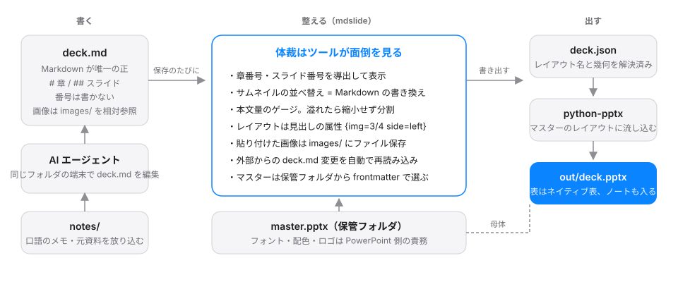

<p align="center"></p>

# mdslide

Markdown を書くと、報告用の PowerPoint 資料になる。macOS のデスクトップアプリ(Electron)。


- **書くのは Markdown だけ**。章番号・スライド番号・ページ分割は、ツールが毎回計算して付ける
- **見た目は手持ちの PowerPoint マスターがそのまま**。フォント・配色・ロゴは pptx 側の責務で、ツールは「どのレイアウトに何を流し込むか」だけを決める
- **AI エージェントと同じフォルダで作業できる**。コンソールで動く Claude Code などが Markdown を書き換えると、すぐに反映される

## コンセプト



報告資料づくりで手間なのは中身ではなく体裁の手直しでした。並べ替えたら番号を振り直す、本文が溢れたらフォントを縮める、図を貼り直す。mdslide はその部分をツール側に引き取り、人は Markdown を書くことに集中します。

1. **Markdown が唯一の正**。左ペインでの並べ替えやレイアウト変更も、すべて Markdown の書き換えとして実装している。GUI とテキストの二重管理をしないので、Git で差分が追えるし、AI が書き換えても壊れない
2. **書式は PowerPoint に任せる**。レイアウト名を `Cover / Agenda / Section / Body-Text / Body-2col` と付けたマスター pptx を保管フォルダに置き、資料ごとに選ぶ。ツールは書式を持たない
3. **本文量は縮めずに分ける**。表示行モデルでスライドごとの本文量を推定してゲージに出し、溢れたら自動でページを分割する。読めない資料を作らない
4. **入口は Markdown ファイル、単位はフォルダ**。開いた `.md` と同じフォルダの `images/`(貼り付けた画像)、`notes/`(下書き・素材)、`out/`(生成物)がひとまとまり。フォルダごと渡せる
5. **AI は隣で動く**。中央ペイン下のコンソールで Claude Code / Codex CLI / Gemini CLI などをそのフォルダで起動し、「下書き」に書いたメモを渡して整形させたり、マスターの配色に沿った図を生成させたりする。規約を書いた `AGENTS.md` と、それを読み込む `CLAUDE.md`(中身は `@AGENTS.md` の 1 行)がフォルダに自動で置かれる

## はじめの 5 分

1. [Releases](https://github.com/froggugugugu/mdslide/releases/latest) の dmg を入れる(Apple silicon 向け。Apple の公証を受けていないので、初回の開き方は下の「インストール」を見る)。pptx を出すには Python と python-pptx も要る。見つからなければ起動時に案内が出て、設定(⌘,)の「書き出し」に入れ方がある
2. 起動画面で「新しく作る」を押し、資料のフォルダを選ぶ(ダイアログで新しく作ってもよい)。その中に `deck.md` が表紙・章・スライド 1 枚だけの空の枠でできる。題はフォルダ名(見本を触りたければ「サンプルを見る」)
3. 設定(⌘,)の「マスター」で、レイアウト名を規約どおりに付けた pptx を保管フォルダに取り込む(最初の 1 つは既定のマスターになる)。資料ごとに変えるならツールバーのマスター選択で、その選択は Markdown の frontmatter に `master: 名前.pptx` として書かれる。見本の `examples/sample-master.pptx` をそのまま使ってもよい。手持ちのテンプレートから作る手順と AI 用のプロンプトは [docs/master-guide.md](docs/master-guide.md)
4. 右ペインで書く(既定は Vim キーバインド。設定の「エディタ」で通常のテキスト編集に切り替えられる)。左ペインでドラッグか ⌥↑↓ で並べ替える。番号は自動で振り直される
5. 「書き出す」で `out/deck.pptx` ができる。PowerPoint で開いて仕上げる

2 回目からは起動画面の「最近開いたもの」から続きができる。

### AI エージェントに任せる

1. 「下書き」(⌘I)に口語でメモを書く。`notes/` に自動保存され、ファイルをドロップしても `notes/` に入る
2. コンソール(⌘J)でエージェントを起動し、「整形して deck.md に」を押す。渡す材料はチェックで選べる
3. 「図を統一テーマで生成」で、`` の仮置きが `theme.json`(マスターから抽出した配色)の PNG に置き換わる
4. 気に入らなければ「前の版に戻す」(`.mdslide/history/`)

フォルダには規約を書いた `AGENTS.md`(と、それを `@AGENTS.md` で読み込む `CLAUDE.md`)、`theme.json`、図の生成ヘルパー `tools/mdslide_draw.py` が自動で置かれる。

## 動作環境

| 項目 | 要件 |
| --- | --- |
| OS | macOS(Electron)。Linux / Windows は未検証 |
| Node.js | 24.15 以上(ソースから動かす場合。`.node-version` / `.nvmrc` を置いてあるので fnm / nvm / asdf はそのまま切り替わる) |
| Python | pptx の書き出しに Python 3.9 以上と python-pptx。図の生成を AI に任せるなら 3.12 と `requirements.txt` |
| AI エージェント | 任意。PATH 上の `claude` `codex` `gemini` `aider` `copilot` `cursor-agent` `opencode` を検出して起動する |

ブラウザ版(`npm run dev:web`)は開発と E2E テストのためのもの。Chromium 限定で、pptx 生成とコンソールは使えない。

## インストール

配布版は [Releases](https://github.com/froggugugugu/mdslide/releases/latest) の dmg をダウンロードする(Apple silicon 向け)。アドホック署名だけで Apple の公証は受けていないので、初回は macOS に止められる。次のどちらかで開く。

- dmg から「アプリケーション」に入れて一度開き、開発元を検証できないという警告を「完了」で閉じる。システム設定の「プライバシーとセキュリティ」の下の方に出る「このまま開く」を押し、パスワードか Touch ID で許可する。以後はそのまま起動する
- ターミナルで次を実行する(「壊れているため開けません」と出た場合もこれで開ける)

```bash
xattr -dr com.apple.quarantine /Applications/mdslide.app
```

macOS 15 以降は、Finder の右クリックから「開く」を選んでも開けない。

pptx の書き出しには、この Mac に Python と python-pptx が必要(アプリには含まれない)。アプリは起動時に確認し、見つからなければ案内を出す。おすすめは mdslide 専用の環境に入れる方法で、アプリはこの場所を最初に探す。

```bash
python3 -m venv ~/.config/mdslide/venv
~/.config/mdslide/venv/bin/python -m pip install python-pptx
```

Python 自体が無ければ、先に `xcode-select --install` を実行する(Command Line Tools に Python 3 が入っている)。Python の場所は設定の「書き出し」で指定することもできる。

ソースから動かす場合。Node は 24.15 以上(`.npmrc` の `engine-strict` により、古い Node では `npm ci` が最初に止まる)。node-pty のビルドに Xcode Command Line Tools(`xcode-select --install`)が要る。

```bash
npm ci                                       # Electron と node-pty の再ビルドを含む
python3 -m pip install -r requirements.txt   # 開発する場合は requirements-dev.txt
npm run dev
```

配布用のビルドは `npm run dist:mac`(アドホック署名の dmg / zip を `release/` に出す)。GUI を使わずに出力だけ行うこともできる。

```bash
python3 tools/export_pptx.py deck.json --master master.pptx -o out.pptx --assets .
```

## Markdown の書き方

```markdown
---
title: 資料タイトル
subtitle: 副題
agenda: once            # once | per-section | none
numbering: chapter      # chapter (1, 1.1) | flat | none
master: corporate.pptx  # 保管フォルダのマスター。省略時はフォルダの master.pptx
---

# 章タイトル                      → 中表紙。アジェンダの項目にもなる
## 本文スライド
- 箇条書き(2 スペースで階層)
- **太字** と `コード`

## 構成図 {img=3/4 side=left}      → 画像 3/4 幅・左。残りが本文


## 比較 {layout=2col}             → 最初の空行で左右に分かれる
左の内容

右の内容

## 表とノート
| 指標 | 目標 |
| --- | --- |
| 稼働率 | 99.9% |

> note: スピーカーノート
```

| 記法 | 意味 |
| --- | --- |
| `# 見出し` | 章(中表紙)。`#` より前の `##` は通し番号になる |
| `## 見出し {属性}` | 本文スライド。属性は Pandoc 形式 |
| `{img=1/1 \| 3/4 \| 1/2} {side=left \| right}` | 画像スライド。画像はアスペクト比を保って枠に内接 |
| `{layout=2col}` | 2 カラム。`Body-2col` レイアウトに流し込む |
| `{size=16}` | そのスライドの本文フォントサイズ(pt) |
| `` | 画像の仮置き。この行で貼り付けると置き換わる |
| `> note:` | スピーカーノート |
| `---` | 本文内の明示的なページ分割 |

詳細は [docs/markdown-spec.md](docs/markdown-spec.md)。

## ワークスペースの構成

開いた Markdown の親フォルダが作業の単位になる。名前は自由で、フォルダを開いたときだけ `deck.md` が使われる。

```text
my-deck/
├── report.md            # 唯一の正(開いた Markdown。名前は自由)
├── images/              # 貼り付けた画像(相対パスで参照)
├── master.pptx          # このフォルダ専用のマスター(任意。通常は保管フォルダから frontmatter で選ぶ)
├── deck.json            # 書き出しの中間形式(契約 v2)
├── out/deck.pptx        # 生成結果
├── notes/               # 下書き・素材
├── theme.json           # マスターから抽出した配色とフォント
├── tools/mdslide_draw.py
├── AGENTS.md            # エージェント向けの規約(初回のみ生成、編集可)
├── CLAUDE.md            # @AGENTS.md の 1 行。Claude Code は同じ規約を読む
└── .mdslide/history/    # deck.md のスナップショット
```

## 設定

設定は 1 ファイル `~/.config/mdslide/settings.json`(`XDG_CONFIG_HOME` 準拠、`MDSLIDE_CONFIG` で場所を変更できる)に置く。手で編集した内容はウィンドウにフォーカスが戻ったときに反映される。マスターの保管フォルダ(`masters.dir`)、既定のマスター(`masters.default`)、Vim キーバインド(`editor.vim`)、エディタ幅(`editor.width`)もここにある。

| 環境変数 | 用途 |
| --- | --- |
| `MDSLIDE_CONFIG` | 設定ファイルのパス |
| `MDSLIDE_PYTHON` | pptx の書き出しに使う Python。指定するとそれだけを使い、自動では探さない |
| `MDSLIDE_NODE` | node-pty を読み込めない環境で端末を中継する Node(既定 `node`) |

## 開発

```bash
npm run dev                  # Electron(electron-vite dev)
npm run dev:web              # ブラウザ版 http://localhost:5173
npm run typecheck            # tsc(src+tests / electron)
npm test                     # vitest(単体 + 内部結合)
npm run test:coverage        # 閾値 lines 80% / branches 70%
npm run test:py              # pytest(deck.json → pptx、図生成)
npm run test:e2e             # Web E2E(headless Chromium)
npm run test:e2e:electron    # Electron E2E(実アプリを起動。要ディスプレイ)
npm run test:all             # 上記すべて。PR の条件
```

| 層 | 場所 | 保証すること |
| --- | --- | --- |
| 単体 | `tests/unit/` | parser / render / fit / geometry / importMaster / workspace / 各コンポーネント |
| 内部結合 | `tests/integration/` | store を通した Markdown → スライド → 保存、フォルダ監視と競合 |
| Python | `tests/python/` | deck.json → pptx。レイアウト解決、画像内接、表、ノート、警告 |
| E2E | `tests/e2e/` | ユーザーが実際に行う一連の操作。Web は OPFS、Electron は CDP |

リリースは `package.json` の `version` を上げてタグを push する。`release.yml` が macOS ランナーで dmg / zip をビルドし、Releases に添付する。使い方ページ(GitHub Pages)は main への push で `pages.yml` が更新する。

```bash
git tag v0.1.0 && git push origin v0.1.0
```

設計の要点は次のとおり。詳細は [CLAUDE.md](CLAUDE.md) と [docs/adr/](docs/adr/)。

- `src/model/` は純粋関数。React にも Electron にも依存しない
- `src/store/` は Zustand。`markdown` 以外はすべて派生値
- レンダラから Node API を直接触らない。IPC の窓口は `electron/preload.ts` だけ
- プレビューと Python 出力は同じ幾何(`deck.json` の `geometry`)と同じ表示行モデルを共有する
- 振る舞いの変更はテストから始める。カバレッジ閾値は下げない

## 依存関係の固定

サプライチェーン攻撃への備えとして、依存はすべて完全一致で固定し、更新は PR 経由でのみ取り込む。

- **npm**: `package.json` は完全一致のバージョン(`.npmrc` の `save-exact`)。`package-lock.json` をコミットし、セットアップも CI も `npm ci`
- **Python**: `requirements.txt`(実行時)と `requirements-dev.txt`(テスト)で `==` 固定
- **GitHub Actions**: タグではなくコミット SHA で固定(コメントにバージョンを併記)。ワークフローの `GITHUB_TOKEN` は読み取り専用
- **更新**: Dependabot が週次で PR を出す。CI が緑のものだけ取り込む
- **Electron 本体**: バイナリの取得時に `@electron/get` が `SHASUMS256.txt` で検証する
- **コンソールで起動する CLI**: PATH 上のものをそのまま使う。このリポジトリは AI エージェントを同梱しない

## ドキュメント

- 紹介ページ: https://froggugugugu.github.io/mdslide/ (この README は同サイトの [README.html](https://froggugugugu.github.io/mdslide/README.html))
- [docs/markdown-spec.md](docs/markdown-spec.md): Markdown 規約
- [docs/master-guide.md](docs/master-guide.md): マスター pptx の作り方（見本、PowerPoint での手順、AI 用プロンプト）
- [docs/testing.md](docs/testing.md): テスト方針と環境
- [docs/adr/](docs/adr/): 設計判断の記録
- [docs/backlog.md](docs/backlog.md): バックログ
- [CLAUDE.md](CLAUDE.md): 変えてはいけない原則と構成

## クレジット

このプロジェクトは [project-blueprints](https://github.com/froggugugugu/project-blueprints) を利用して開発している。Claude Code のルール・スキル・エージェント・品質ゲートといった開発の枠組みはそこから来ており、このリポジトリには mdslide 固有の規約(`CLAUDE.md`、`.claude/rules/`)だけを含めている。

## ライセンス

[MIT](LICENSE)
